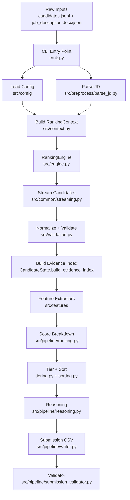
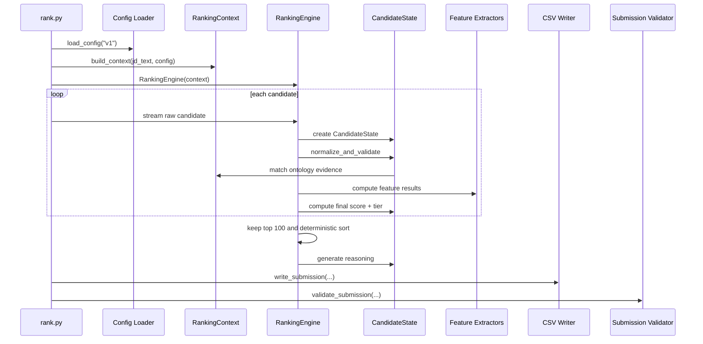
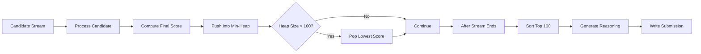
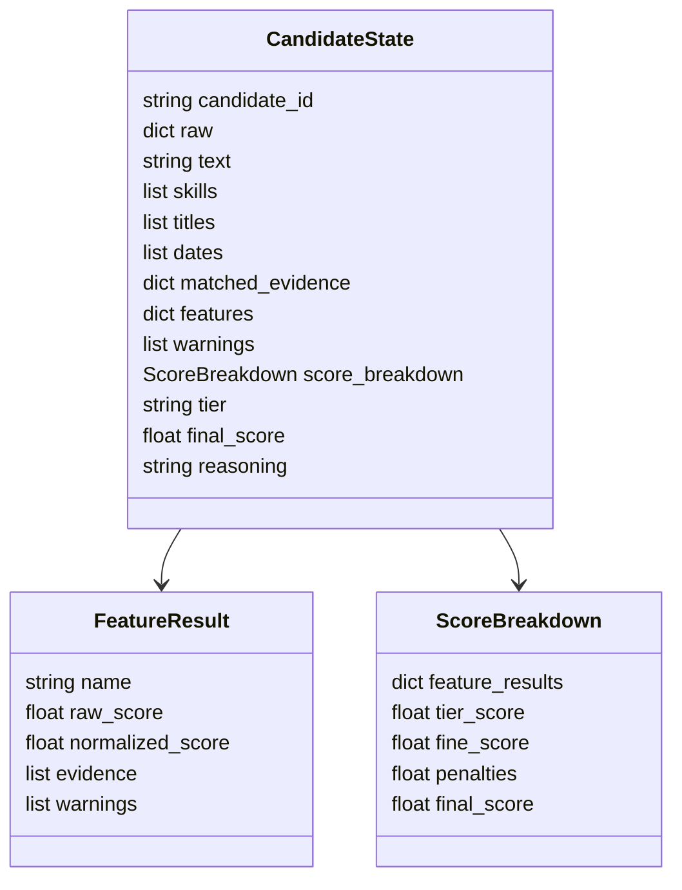

# TalentGraph AI Project Report

## 1. Executive Summary

TalentGraph AI is a deterministic, CPU-only candidate ranking engine built for the Redrob Intelligent Candidate Discovery & Ranking Challenge. Its job is simple to state but difficult to do well: read a large candidate dataset, understand how each profile matches a target job description, rank the strongest candidates, and produce a valid submission CSV with evidence-backed reasoning.

The project deliberately avoids opaque model calls at runtime. Instead, it uses a transparent evidence ontology, explicit feature extractors, deterministic scoring, top-k streaming, and validation checks. This makes the result explainable, reproducible, and practical under hackathon-style CPU and memory limits.

The final system:

- Streams candidate records instead of loading everything into memory.
- Normalizes each profile into a reusable `CandidateState`.
- Extracts capability evidence from skills, titles, summaries, and career text.
- Computes independent feature scores for job coverage, production experience, experience fit, consistency, market validation, hireability, preferred matches, and penalties.
- Keeps only the best 100 candidates in memory.
- Writes `candidate_id`, `rank`, `score`, and `reasoning` to the submission CSV.
- Validates row count, rank uniqueness, candidate uniqueness, score ordering, and non-empty reasoning.

## 2. Problem Statement

Recruiting datasets are noisy. Candidate profiles may contain partial skills, inconsistent job titles, missing dates, vague summaries, and uneven formatting. A good ranking system must therefore do more than keyword matching. It must identify evidence, judge relevance to the role, stay robust when fields are incomplete, and explain its decision in plain language.

For this project, the core challenge was to rank candidates for a role involving retrieval, ranking, evaluation, vector search, and production machine learning. The system needed to reward direct evidence like `FAISS`, `RAG`, `learning to rank`, `model serving`, and `A/B testing`, while also recognizing related signals like `semantic search`, `NDCG`, `offline evaluation`, and `deployed model`.

The ranking output also needed to be deterministic. Two runs on the same data should produce the same order.

## 3. Design Goals

| Goal | Why It Matters | How The Project Handles It |
|---|---|---|
| Explainability | Reviewers should understand why a candidate ranks highly. | Uses evidence-backed feature scores and generated reasoning. |
| Determinism | Results should be reproducible. | Uses fixed config, fixed sorting, no runtime network calls, and `candidate_id` tie-breaks. |
| Scalability | The candidate file can be large. | Streams input and keeps only the top 100 candidates in a heap. |
| Robustness | Candidate data can be incomplete or malformed. | Normalization and validation collect warnings but continue processing. |
| Simplicity | The system should be easy to inspect and improve. | Features are modular Python classes registered by name. |
| Submission safety | Output must pass expected CSV checks. | Local validator checks ranks, IDs, scores, row count, and reasoning. |

## 4. High-Level Architecture



The architecture is layered:

1. **Configuration layer** defines what matters.
2. **Preprocessing layer** parses and normalizes input.
3. **Model layer** stores candidate state and scoring artifacts.
4. **Feature layer** computes independent signals.
5. **Pipeline layer** combines, sorts, explains, writes, and validates.
6. **Diagnostics layer** supports audit reports and future experiments.

## 5. Runtime Journey

The runtime journey starts in `rank.py`:

1. Parse command-line arguments.
2. Load scoring/config version `v1`.
3. Parse the job description.
4. Build a `RankingContext`.
5. Stream candidates from JSONL.
6. Optionally limit candidates for smoke testing.
7. Rank candidates using `RankingEngine`.
8. Write the CSV.
9. Validate the CSV.

The smoke command used during verification was:

```bash
./venv/bin/python rank.py \
  --candidates data/raw/candidates/candidates.jsonl \
  --jd data/raw/jd/job_description.docx \
  --out /tmp/redrob_smoke_submission.csv \
  --limit 10
```

It completed successfully and validated the output.

## 6. Data Flow



## 7. Core Methodology

The methodology is evidence-first ranking. Instead of asking a model to infer the best candidates, the system defines a clear map from phrases to capabilities.

Examples:

| Evidence Phrase | Strength | Capability |
|---|---:|---|
| `faiss` | Direct | retrieval, vector database |
| `rag` | Direct | retrieval |
| `learning to rank` | Direct | ranking |
| `ab testing` | Direct | evaluation |
| `model serving` | Direct | production ML |
| `semantic search` | Related | retrieval |
| `ndcg` | Related | ranking, evaluation |
| `information retrieval` | Implicit | retrieval |

The system then asks:

- Does this candidate show the required capabilities?
- Are the signals direct, related, or only implicit?
- Is the work production-grade?
- Does the experience level fit the target?
- Is the profile internally consistent?
- Are there preferred signals beyond the minimum requirements?
- Are there warning signs or penalties?

This approach keeps the system readable. A reviewer can inspect `src/config/ontology.py`, `src/config/scoring_v1.py`, and each feature module to understand exactly what influences the score.

## 8. Capability Ontology

The ontology in `src/config/ontology.py` defines the core domain vocabulary.

Required capabilities:

- `retrieval`
- `ranking`
- `evaluation`
- `vector_db`
- `production_ml`

Preferred capabilities:

- `llm_finetuning`
- `learning_to_rank`
- `hrtech`
- `inference_optimization`

Evidence strengths:

| Strength | Weight | Meaning |
|---|---:|---|
| Direct | 1.0 | Strong explicit evidence. |
| Related | 0.6 | Relevant but not as exact. |
| Implicit | 0.3 | Weak or inferred signal. |

The ontology is intentionally compact. That is a strength for auditability, but also a future expansion area: more domain terms can improve recall without changing the pipeline design.

## 9. Scoring Model

The scoring configuration is in `src/config/scoring_v1.py`.

Feature execution order:

1. `jd_coverage`
2. `production`
3. `experience_fit`
4. `consistency`
5. `market_validation`
6. `hireability`
7. `preferred_match`
8. `penalties`

Primary tier weights:

| Feature | Weight |
|---|---:|
| Job description coverage | 0.40 |
| Production strength | 0.20 |
| Experience fit | 0.08 |
| Consistency | 0.07 |

Fine-grained weights:

| Feature | Weight |
|---|---:|
| Market validation | 0.10 |
| Hireability | 0.05 |
| Preferred match | 0.05 |

Penalty weight:

| Feature | Weight |
|---|---:|
| Penalties | 0.05 |

Final score calculation:

```text
tier_score = weighted average of:
  jd_coverage, production, experience_fit, consistency

fine_score = weighted average of:
  market_validation, hireability, preferred_match

final_score = clamp(tier_score + penalties, 0.0, 1.0)
```

Important note: the code computes `fine_score`, but the exported final sort currently uses rounded `final_score` and then `candidate_id` as the tie-breaker. This keeps the current submission deterministic, but a future improvement would be to include `fine_score` in sorting when two candidates have the same submission score.

## 10. Ranking And Top-K Strategy

The engine uses a min-heap to keep only the top 100 candidates.



Why this matters:

- Memory stays bounded.
- The system can process large files.
- The best candidates are retained without storing every profile.

Tie-breaking is deterministic:

1. Higher rounded final score first.
2. Lower `candidate_id` alphabetically if scores tie.

## 11. Output Schema

The final submission CSV is written by `src/pipeline/writer.py`.

```csv
candidate_id,rank,score,reasoning
```

Column meanings:

| Column | Type | Description |
|---|---|---|
| `candidate_id` | string | Unique candidate identifier from the raw input. |
| `rank` | integer | Rank position starting at 1. |
| `score` | decimal string | Final score formatted to four decimals. |
| `reasoning` | string | Human-readable explanation generated from evidence. |

Validation rules:

- Exactly the expected number of rows.
- Every row has `candidate_id`, `rank`, `score`, and `reasoning`.
- Ranks cover `1..N` exactly.
- No duplicate ranks.
- No duplicate candidate IDs.
- Scores are monotonically non-increasing.
- Reasoning is not empty.

## 12. Candidate State Schema

Each raw candidate is transformed into a `CandidateState`.



The state object is the project's main internal handoff format. It lets validation, evidence extraction, features, scoring, tiering, and reasoning communicate without repeatedly parsing the raw candidate dictionary.

## 13. Feature Modules

| Module | Purpose |
|---|---|
| `src/features/jd.py` | Measures coverage of required job capabilities. |
| `src/features/production.py` | Rewards production ML, serving, deployed systems, and operational experience. |
| `src/features/experience.py` | Scores years of experience against the configured target range. |
| `src/features/consistency.py` | Checks alignment among title, skills, career history, and evidence. |
| `src/features/market.py` | Looks for external-market validation signals such as known tools and credible technical markers. |
| `src/features/hireability.py` | Estimates practical hireability from profile completeness and role fit. |
| `src/features/preferred.py` | Rewards preferred but non-mandatory signals. |
| `src/features/penalties.py` | Applies negative adjustments for disqualifying or weak signals. |
| `src/features/base.py` | Defines the feature interface. |
| `src/features/registry.py` | Registers and constructs feature extractors in configured order. |
| `src/features/utils.py` | Shared helpers for feature calculations. |

This modular feature design makes the system easy to extend. A new feature can be added by implementing the interface, registering it, and adding it to the config order and weights.

## 14. Project Structure

```text
TalentGraphAI/
  rank.py
  preprocess.py
  benchmark.py
  run_diagnostics.py
  src/
    common/
    config/
    diagnostics/
    features/
    models/
    pipeline/
    preprocess/
  data/
    raw/
    processed/
    output/
  docs/
  notebooks/
  scripts/
  tests/
```

## 15. File-By-File Explanation

### Root Files

| File | Explanation |
|---|---|
| `README.md` | Quick project overview, run commands, architecture summary, and design principles. |
| `PROJECT_REPORT.md` | This in-depth project report. |
| `rank.py` | Main CLI entry point for ranking candidates and validating the submission. |
| `preprocess.py` | Root-level preprocessing entry point for preparing input artifacts. |
| `benchmark.py` | Root-level benchmark runner for performance checks. |
| `run_diagnostics.py` | Root-level diagnostics runner for audit/report generation. |
| `requirements.txt` | Minimal Python dependencies for runtime and tests. |
| `pyproject.toml` | Project metadata, build configuration, formatter settings, type-checking settings, and pytest config. |
| `submission_metadata.yaml` | Metadata for the generated challenge submission. |
| `LICENSE` | MIT license. |

### Documentation Files

| File | Explanation |
|---|---|
| `docs/architecture.md` | Short architecture summary. |
| `docs/methodology.md` | Short methodology summary. |
| `docs/pipeline.md` | Pipeline-specific notes. |
| `docs/ontology.md` | Ontology design notes. |
| `docs/scoring.md` | Scoring design notes. |
| `docs/diagnostics.md` | Diagnostics notes. |
| `docs/benchmark.md` | Benchmarking notes. |

### Scripts

| File | Explanation |
|---|---|
| `scripts/generate_submission.py` | Helper script for creating a submission artifact. |
| `scripts/prepare_data.py` | Helper script for preparing raw data into processed form. |
| `scripts/profile_runtime.py` | Runtime profiling helper. |
| `scripts/run_all_tests.py` | Test runner wrapper. |
| `scripts/run_benchmark.py` | Benchmark runner wrapper. |
| `scripts/validate_submission.sh` | Shell wrapper for submission validation. |

### Tests

| File | Explanation |
|---|---|
| `tests/test_common.py` | Verifies common text normalization behavior. |
| `tests/test_integration.py` | Verifies the ranking engine can rank a small candidate set correctly. |
| `tests/__init__.py` | Marks `tests` as a Python package. |

### Data Files

| File | Explanation |
|---|---|
| `data/README.docx` | Data-specific readme/documentation. |
| `data/raw/candidates/candidates.jsonl` | Main raw candidate input file. |
| `data/raw/candidates/sample_candidates.json` | Sample candidate data. |
| `data/raw/jd/job_description.docx` | Raw job description input. |
| `data/raw/docs/candidate_schema.json` | Candidate input schema. |
| `data/raw/docs/submission_spec.docx` | Submission specification from the challenge. |
| `data/raw/docs/redrob_signals_doc.docx` | Domain signal documentation. |
| `data/raw/submission/sample_submission.csv` | Example submission format. |
| `data/raw/submission/submission_metadata_template.yaml` | Metadata template. |
| `data/raw/submission/validate_submission.py` | Challenge-provided or raw validation helper. |
| `data/processed/parsed_jd.json` | Parsed job description artifact. |
| `data/processed/compiled_patterns.pkl` | Precomputed regex/pattern artifact. |
| `data/processed/feature_cache.pkl` | Cached feature artifact. |
| `data/output/submission.csv` | Current generated submission output. |
| `data/output/logs/.gitkeep` | Keeps empty logs directory available. |
| `data/output/reports/.gitkeep` | Keeps empty reports directory available. |
| `data/output/benchmark/.gitkeep` | Keeps empty benchmark output directory available. |

### Notebooks

| File | Explanation |
|---|---|
| `notebooks/benchmark.ipynb` | Notebook for benchmark exploration. |
| `notebooks/feature_analysis.ipynb` | Notebook for studying feature behavior. |
| `notebooks/ontology_analysis.ipynb` | Notebook for ontology exploration. |
| `notebooks/score_distribution.ipynb` | Notebook for analyzing score distribution. |

### `src/common`

| File | Explanation |
|---|---|
| `src/common/text.py` | Text normalization and candidate text assembly. |
| `src/common/dates.py` | Date parsing helpers used during validation. |
| `src/common/streaming.py` | Streams candidate records from JSON/JSONL-style inputs. |
| `src/common/regex.py` | Regex utilities. |
| `src/common/math_utils.py` | Numeric helper functions. |
| `src/common/io.py` | File input/output helpers. |
| `src/common/constants.py` | Shared constants. |
| `src/common/logging_utils.py` | Logging helpers. |
| `src/common/timing.py` | Timing utilities. |
| `src/common/__init__.py` | Public exports for common utilities. |

### `src/config`

| File | Explanation |
|---|---|
| `src/config/ontology.py` | Defines evidence phrases, evidence weights, required capabilities, and preferred capabilities. |
| `src/config/scoring_v1.py` | Defines feature order, scoring weights, penalties, and experience targets. |
| `src/config/thresholds.py` | Defines tier thresholds. |
| `src/config/runtime.py` | Runtime constants such as batch size and output directory. |
| `src/config/keywords.py` | Required and preferred keyword lists. |
| `src/config/loader.py` | Loads and validates all config into a `RankingConfig`. |
| `src/config/__init__.py` | Config package exports. |

### `src/models`

| File | Explanation |
|---|---|
| `src/models/candidate_state.py` | Main per-candidate state object and evidence-index builder. |
| `src/models/ranking_context.py` | Immutable context with JD text, capability lists, compiled patterns, weights, and thresholds. |
| `src/models/evidence_item.py` | Dataclass for matched evidence. |
| `src/models/feature_result.py` | Dataclass for feature outputs. |
| `src/models/score_breakdown.py` | Dataclass for score components. |
| `src/models/validation_result.py` | Dataclass for validation results. |
| `src/models/__init__.py` | Model package exports. |

### `src/preprocess`

| File | Explanation |
|---|---|
| `src/preprocess/parse_jd.py` | Parses JSON, DOCX, or text job-description inputs. |
| `src/preprocess/normalize.py` | Preprocessing normalization helpers. |
| `src/preprocess/compile_patterns.py` | Pattern compilation helper. |
| `src/preprocess/build_indexes.py` | Index-building helper. |
| `src/preprocess/evidence_index.py` | Evidence indexing helper. |
| `src/preprocess/synonym_index.py` | Synonym indexing helper. |
| `src/preprocess/company_index.py` | Company indexing helper. |
| `src/preprocess/cache.py` | Cache helper for processed artifacts. |
| `src/preprocess/validation.py` | Preprocessing validation helper. |
| `src/preprocess/__init__.py` | Preprocess package exports. |

### `src/features`

| File | Explanation |
|---|---|
| `src/features/base.py` | Feature base class/interface. |
| `src/features/registry.py` | Feature registry and feature factory. |
| `src/features/jd.py` | Job-description coverage feature. |
| `src/features/production.py` | Production ML evidence feature. |
| `src/features/experience.py` | Experience fit feature. |
| `src/features/consistency.py` | Candidate consistency feature. |
| `src/features/market.py` | Market validation feature. |
| `src/features/hireability.py` | Hireability feature. |
| `src/features/preferred.py` | Preferred capability feature. |
| `src/features/penalties.py` | Penalty feature. |
| `src/features/utils.py` | Shared feature helpers. |
| `src/features/__init__.py` | Imports/registers feature classes. |

### `src/pipeline`

| File | Explanation |
|---|---|
| `src/pipeline/ranking.py` | Computes tier score, fine score, penalties, and final score. |
| `src/pipeline/tiering.py` | Assigns tier labels from thresholds. |
| `src/pipeline/sorting.py` | Sorts candidates deterministically for submission. |
| `src/pipeline/reasoning.py` | Generates explanation text from candidate evidence and scores. |
| `src/pipeline/reason_templates.py` | Reasoning phrase templates. |
| `src/pipeline/writer.py` | Writes final submission CSV. |
| `src/pipeline/submission_validator.py` | Validates submission format and ordering. |
| `src/pipeline/exporter.py` | Export helper. |
| `src/pipeline/metrics.py` | Metrics helper. |
| `src/pipeline/__init__.py` | Pipeline package exports. |

### `src/diagnostics`

| File | Explanation |
|---|---|
| `src/diagnostics/ablation.py` | Supports feature ablation experiments. |
| `src/diagnostics/candidate_report.py` | Candidate-level diagnostic summary helper. |
| `src/diagnostics/capability_attribution.py` | Attributes scores to capabilities. |
| `src/diagnostics/capability_contribution.py` | Reports capability contribution. |
| `src/diagnostics/capability_necessity.py` | Studies whether required capabilities are present. |
| `src/diagnostics/direct_dependency.py` | Checks direct dependency/evidence relationships. |
| `src/diagnostics/evidence_exclusivity.py` | Analyzes overlapping evidence. |
| `src/diagnostics/evidence_precision.py` | Helps audit evidence quality. |
| `src/diagnostics/feature_importance.py` | Reports feature-level contribution. |
| `src/diagnostics/feature_statistics.py` | Summarizes feature distributions. |
| `src/diagnostics/honeypot_analysis.py` | Supports checks against weak/honeypot candidates. |
| `src/diagnostics/implicit_gain.py` | Studies value from implicit evidence. |
| `src/diagnostics/ontology_report.py` | Reports ontology coverage. |
| `src/diagnostics/ontology_stress.py` | Stress-tests ontology behavior. |
| `src/diagnostics/runtime_profile.py` | Runtime profiling helper. |
| `src/diagnostics/score_distribution.py` | Score distribution diagnostics. |
| `src/diagnostics/validation_report.py` | Validation summary helper. |
| `src/diagnostics/__init__.py` | Diagnostics package exports. |

### Other Source Files

| File | Explanation |
|---|---|
| `src/context.py` | Builds the immutable ranking context from JD text and config. |
| `src/engine.py` | Main ranking engine. Processes candidates, computes features, keeps top 100, and generates reasoning. |
| `src/validation.py` | Normalizes raw candidate data and records validation warnings/errors. |
| `src/__init__.py` | Source package marker. |

## 16. Key Engineering Decisions

### Decision 1: Deterministic Rules Over Runtime AI Calls

Runtime model calls could introduce latency, cost, network dependency, and non-determinism. The project uses transparent rules and feature scoring instead. This is a good fit for a challenge where the output must be reproducible and easy to audit.

### Decision 2: Streaming Instead Of Full Dataset Loading

The ranking engine processes candidates one at a time and stores only the top 100. This is more scalable than loading the full candidate dataset.

### Decision 3: Evidence Index Built Once Per Candidate

Candidate text is scanned once against compiled evidence patterns. Feature modules then reuse `matched_evidence`. This reduces repeated work and keeps features consistent.

### Decision 4: Modular Feature Extractors

Each scoring concern lives in a separate feature module. This avoids one large scoring function and makes future improvements easier.

### Decision 5: Local Validation After Writing

The system validates its own output immediately after writing. This catches formatting mistakes early.

## 17. Difficulties Faced

### Noisy Candidate Data

Candidate data is rarely perfectly structured. The project handles missing experience, missing skills, and timeline inconsistencies as warnings rather than fatal errors. This lets the ranker continue while still preserving audit information.

### Balancing Precision And Recall

Strict keyword matching is precise but can miss relevant candidates. Loose matching catches more candidates but can create false positives. The ontology balances this by separating direct, related, and implicit evidence.

### Keeping Reasoning Honest

Generated reasoning must not claim facts that are not present. The system generates explanations from extracted evidence and feature results rather than inventing narrative text.

### Maintaining Determinism

Sorting ties can create unstable results if not handled carefully. The project uses `candidate_id` as the final tie-breaker.

### Avoiding Memory Growth

The top-k heap prevents memory from growing with dataset size.

## 18. Mistakes And Lessons Learned

This project also had a few practical mistakes that were fixed or documented:

1. **Placeholder tests created noise.**  
   Several zero-byte test files and empty fixture files existed but did not add coverage. They made the project look larger than it was and caused pytest collection to appear misleading. These were removed during cleanup.

2. **Generated artifacts were mixed with source files.**  
   Cache folders and generated diagnostic/smoke outputs were present. These were removed because `.gitignore` already treats them as disposable.

3. **Fine score is computed but not used in final sort.**  
   The code computes `fine_score` for market validation, hireability, and preferred match, but the current final output sort uses `final_score` and `candidate_id`. This is not a breaking bug, but it is an improvement opportunity: use `fine_score` as a secondary tie-breaker after rounded final score.

4. **Test coverage is currently thin.**  
   The active test suite passes, but only has two tests. More feature-level tests would make future changes safer.

5. **Some diagnostics are placeholders or lightweight helpers.**  
   The diagnostics package gives a structure for future analysis, but not every report path is fully implemented yet.

These are useful lessons, not failures. They show where the project moved from a quick challenge build toward a cleaner, more maintainable system.

## 19. Verification Performed

The following checks were run after cleanup:

```bash
./venv/bin/python -m pytest
```

Result:

```text
2 passed
```

Smoke ranking with DOCX job description:

```bash
./venv/bin/python rank.py \
  --candidates data/raw/candidates/candidates.jsonl \
  --jd data/raw/jd/job_description.docx \
  --out /tmp/redrob_smoke_submission.csv \
  --limit 10
```

Result:

```text
Written 10 candidates
Submission validated successfully.
```

Smoke ranking with JSON job description:

```bash
./venv/bin/python rank.py \
  --candidates data/raw/candidates/candidates.jsonl \
  --jd data/processed/parsed_jd.json \
  --out /tmp/redrob_smoke_submission_jsonjd.csv \
  --limit 10
```

Result:

```text
Written 10 candidates
Submission validated successfully.
```

## 20. Strengths Of The Project

- Clear, understandable architecture.
- Deterministic output.
- No runtime network dependency.
- Strong separation between config, models, features, and pipeline.
- Streaming top-k design for large datasets.
- Human-readable reasoning in the final output.
- Submission validation included in the main ranking flow.
- Easy to extend with new features or ontology terms.

## 21. Current Limitations

- Active automated test coverage is small.
- Ontology is compact and can miss synonyms not explicitly listed.
- No semantic embeddings are used, so paraphrase matching is limited.
- Fine score is computed but not currently used as a tie-breaker in exported sorting.
- Diagnostics modules are useful scaffolding but could be made more complete.
- The local `venv/` is useful for development but should not be included in a final submission bundle.

## 22. Recommended Future Improvements

1. Add feature-level tests for every feature module.
2. Use `fine_score` as a secondary sort key after rounded final score.
3. Expand the ontology using observed candidate vocabulary.
4. Add a diagnostic report that explains the top 100 distribution by capability.
5. Add a CLI flag for writing a JSON audit file beside the CSV.
6. Add tests for malformed candidates, missing fields, and duplicate IDs.
7. Add a lightweight benchmark target that reports runtime and memory usage.
8. Improve documentation around generated artifacts versus source artifacts.

## 23. Suggested Final Submission Checklist

- Run the final ranking command.
- Validate `data/output/submission.csv`.
- Confirm `submission_metadata.yaml` is correct.
- Exclude `venv/`, caches, and temporary files.
- Include source code, docs, config, tests, and required data artifacts.
- Include this `PROJECT_REPORT.md` for reviewers.

## 24. Final Assessment

TalentGraph AI is a strong challenge-oriented ranking system because it solves the core problem in a transparent and operationally practical way. It does not depend on hidden model behavior, it explains its choices, it handles large inputs efficiently, and it validates its final artifact.

The best part of the project is its shape: the ranking logic is not buried in one script. It is decomposed into configuration, evidence extraction, feature scoring, ranking, reasoning, and validation. That makes the project easy to read, easy to defend, and easy to improve.

The main thing to improve next is coverage: the architecture is ready for more tests, richer diagnostics, and a slightly more nuanced final sort. But as a working, explainable candidate ranking engine, the project is all set.
